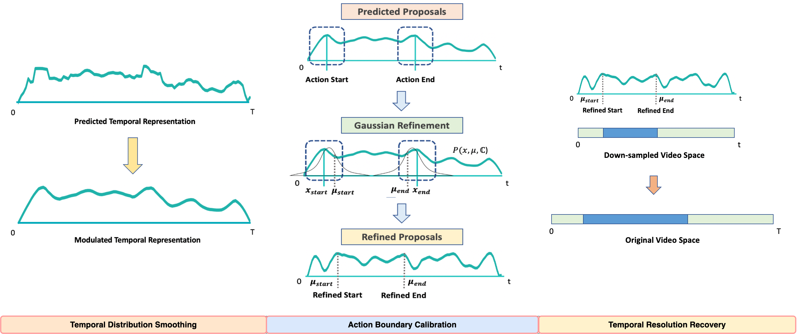

<div align="center">

<h1>Post-Processing Temporal Action Detection</h1>

<div>
    <a href='https://sauradip.github.io/' target='_blank'>Sauradip Nag</a><sup>1,2,+</sup>&emsp;
    <a href='https://scholar.google.co.uk/citations?hl=en&user=ZbA-z1cAAAAJ&view_op=list_works&sortby=pubdate' target='_blank'>Xiatian Zhu</a><sup>1,3</sup>&emsp;
    <a href='https://scholar.google.co.uk/citations?user=irZFP_AAAAAJ&hl=en' target='_blank'>Yi-Zhe Song</a><sup>1,2</sup>&emsp;
    <a href='https://scholar.google.co.uk/citations?hl=en&user=MeS5d4gAAAAJ&view_op=list_works&sortby=pubdate' target='_blank'>Tao Xiang</a><sup>1,2</sup>&emsp;
</div>
<div>
    <sup>1</sup>CVSSP, University of Surrey, UK&emsp;
    <sup>2</sup>iFlyTek-Surrey Joint Research Center on Artificial Intelligence, UK&emsp; <br>
    <sup>3</sup>Surrey Institute for People-Centred Artificial Intelligence, UK
</div>
<div>
    <sup>+</sup>corresponding author
</div>

<h3><strong>Accepted to <a href='https://cvpr2023.thecvf.com/' target='_blank'>CVPR 2023</a></strong></h3>

<h3 align="center">
  <a href="https://openaccess.thecvf.com/content/CVPR2023/papers/Nag_Post-Processing_Temporal_Action_Detection_CVPR_2023_paper.pdf" target='_blank'>Paper</a> |
  <a href="https://sauradip.github.io/project_pages/GAP/" target='_blank'>Project Page</a> |
  <a href="https://cvpr2023.thecvf.com/media/cvpr-2023/Slides/21267.pdf" target='_blank'>Slides</a> |
  <a href="https://cvpr2023.thecvf.com/media/PosterPDFs/CVPR%202023/21267.png?t=1685587366.9226022" target='_blank'>Poster</a> 
</h3>

<table>
<tr>
    <td>


https://github.com/sauradip/GAP/assets/23197350/338a0773-d78a-41f7-9f9e-3846719ce2f0


</td>
</tr>
</table>
</div>

## Updates

- (June, 2023) We released GAP inference code in iPhone notebook for all dataset.
- (Mar, 2023) GAP is accepted by CVPR 2023.

## Summary
- First Non-Learnable Refinement module for Temporal Action Detection.
- Gaussian based Post-Processing for action start and end points
- Taylor expansion helps the model solve the boundary ambiguity issue at sub-snippet level.
- Can be used as a plug-and-play module for both training and inference.

## Abstract

Existing Temporal Action Detection (TAD) methods typically take a pre-processing step in converting an input varying-length video into a fixed-length snippet representation sequence, before temporal boundary estimation and action classification. This pre-processing step would temporally downsample the video, reducing the inference resolution and hampering the detection performance in the original temporal resolution. In essence, this is due to a temporal quantization error introduced during the resolution downsampling and recovery. This could negatively impact the TAD performance, but is largely ignored by existing methods. To address this problem, in this work we introduce a novel model-agnostic post-processing method without model redesign and retraining. Specifically, we model the start and end points of action instances with a Gaussian distribution for enabling temporal boundary inference at a sub-snippet level. We further introduce an efficient Taylor-expansion based approximation, dubbed as Gaussian Approximated Post-processing (GAP). Extensive experiments demonstrate that our GAP can consistently improve a wide variety of pre-trained off-the-shelf TAD models on the challenging ActivityNet (+0.2% -0.7% in average mAP) and THUMOS (+0.2% -0.5% in average mAP) benchmarks. Such performance gains are already significant and highly comparable to those achieved by novel model designs. Also, GAP can be integrated with model training for further performance gain. Importantly, GAP enables lower temporal resolutions for more efficient inference, facilitating low-resource applications.

## Architecture


## Getting Started

### Requirements
- Python 3.7
- PyTorch == 1.9.0  **(Please make sure your pytorch version is atleast 1.8)**
- NVIDIA GPU

### How to use 
Just past the code ins cript to any inference file of standard Temporal Action Detection inference code and it should work. 

### TO-DO Checklist
- [ ] Create a implemented version on BMN
- [ ] Use GAP at training code

## Citation
If you find this project useful for your research, please use the following BibTeX entry.
```
@inproceedings{nag2023post,
  title={Post-Processing Temporal Action Detection},
  author={Nag, Sauradip and Zhu, Xiatian and Song, Yi-Zhe and Xiang, Tao},
  booktitle={Proceedings of the IEEE/CVF Conference on Computer Vision and Pattern Recognition},
  pages={18837--18845},
  year={2023}
}
```


